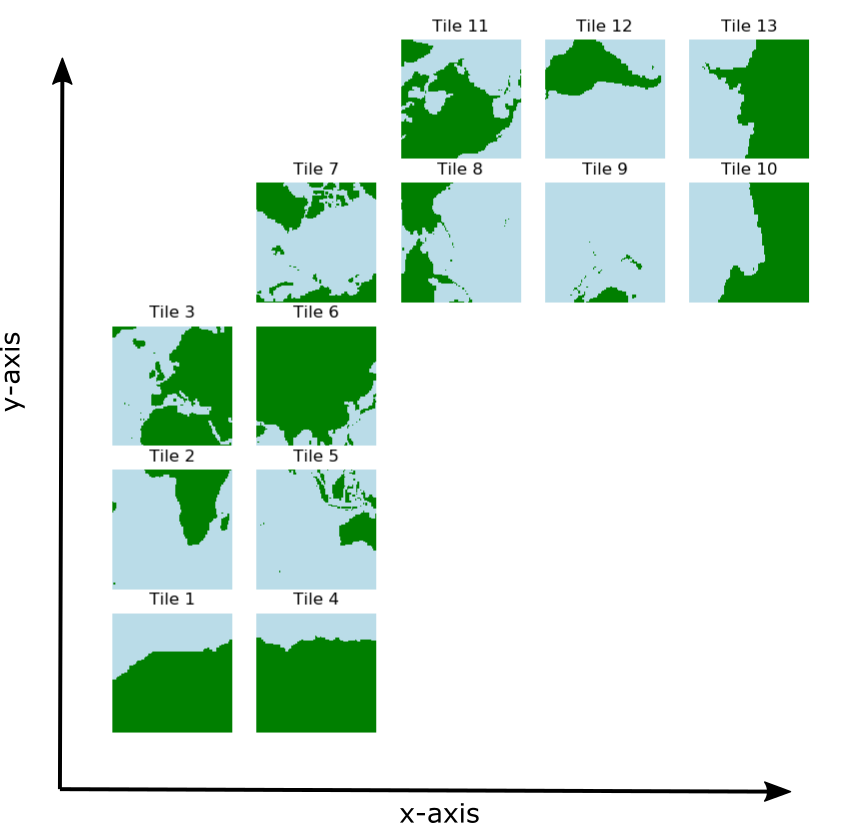

############################################################
ECCO v4 state estimate ocean, sea-ice, and atmosphere fields
############################################################

The complete state estimate consists of a set of ocean, sea-ice, air-sea flux, and atmosphere state variables that are the output from a free-running ocean and sea-ice general circulation model. 

.. _in-layout:

*******************
Geographical layout
*******************

Ocean, sea-ice, air-sea flux, and atmosphere fields are provided in two spatial layouts:

- 13-tile *native* lat-lon-cap 90 (llc90) grid
- 0.5° x 0.5° latitude and longitude grid

13-tile *native* lat-lon-cap 90 grid
====================================

The lat-lon-cap (llc) is the decomposition of the spherical Earth into a Cartesian curvilinear coordinate system .  It is a topologically non-trivial cubed-sphere rendering in the northern hemisphere and a dipolar grid in the southern hemisphere.  Between 70°S and ~57°N, model grid cells are approximately oriented to lines of latitude and longitude.  A special Arctic "cap" is situated north of ~57°N.  

The Cartesian curvilinear coordinate system is divided into 13 tiles, each consisting of 90x90 grid cells in the horizontal and 50 vertical levels.  Horizontal model grid resolution varies spatially from 22km to 110km, with the highest resolutions at high latitudes and lowest resolution in mid latitudes. Vertical grid spacing increases with depth from 10m to 456.5m.  The bottom of the deepest model grid cell is 6145m below the surface.

The Cartesian (x,y) coordinates of llc tiles do not coorespond to longitude and latitude.  Horizontal velocities are defined relative to the **local orientation** of x and y in the tile.  Velocities in the positive *x* direction are defined as positive *u*.  Velocities in the positive *y* direction are defined as positive *v*.

Available fields on the llc90 grid
----------------------------------

*monthly-averaged ocean and sea-ice fields*: ftp://ecco.jpl.nasa.gov/Version4/Release3/nctiles_monthly/README

*monthly-snapshot ocean and sea-ice fields*: ftp://ecco.jpl.nasa.gov/Version4/Release3/nctiles_monthly_snapshots/README

*daily-averaged ocean and sea-ice fields*: ftp://ecco.jpl.nasa.gov/Version4/Release3/nctiles_daily/README

*6-hourly atmosphere fields*: ftp://ecco.jpl.nasa.gov/Version4/Release3/input_forcing/README

*interpolated* 0.5° x 0.5° latitude-longitude grid
==================================================

Select monthly-average fields from the *native* lat-lon-cap model output have been interpolated to a more user-friendly 0.5° latitude-longitude grid.  

Available fields on the 0.5° x 0.5° latitude-longitude grid
-----------------------------------------------------------
0.5° x 0.5° monthly-averaged ocean, sea-ice, and atmosphere fields: 
ftp://ecco.jpl.nasa.gov/Version4/Release3/interp_monthly/README

*******************************************
Temporal frequency of state estimate fields
*******************************************

All three-dimensional ocean, sea-ice, and air-sea flux fields are provided as monthly averages.  Select two-dimensional ocean and sea-ice fields are provided as daily averages.  Atmospheric state fields are provided as 6-hourly records.  In addition, potential temperature (theta), salinity, and free surface height anomaly at the ocean/sea-ice interface (etan) are provided as monthly snapshots to support budget closure calculations.  

*************
Custom output
*************

Because the state estimate fields are the output from a free-running ocean model, users can re-run the model to generate custom output on the native lat-lon-cap model grid.  Instructions for doing so are provided here:
ftp://ecco.jpl.nasa.gov/Version4/Release3/doc/ECCOv4r3_reproduction.pdf

