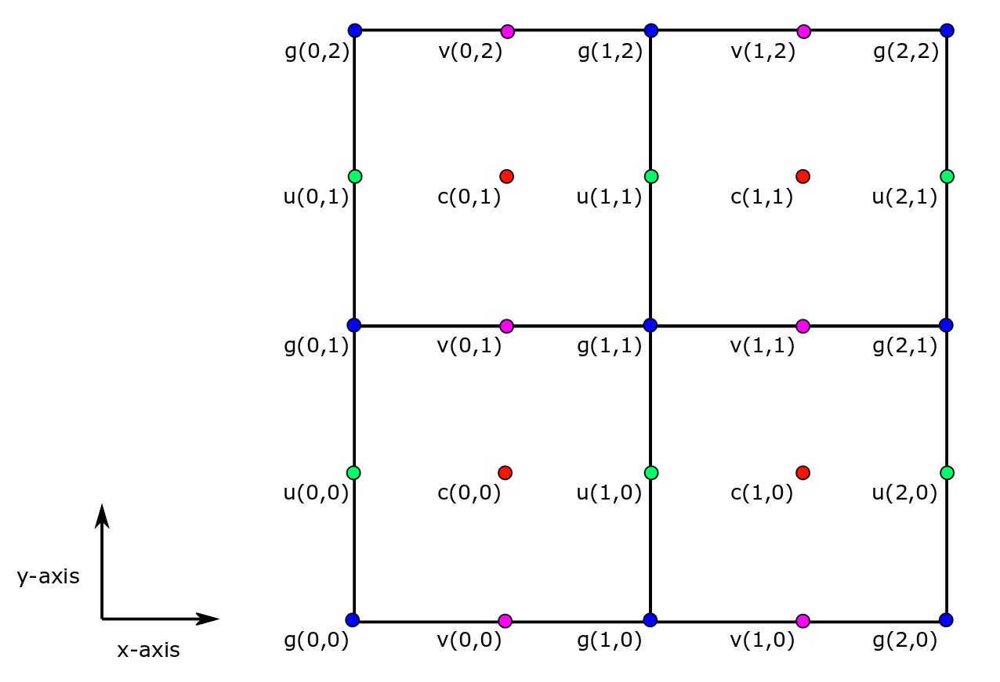

A Better Method for Loading ECCOv4 NetCDF Tile Files
====================================================

Objectives:
-----------

Introduce an alternative method for loading ECCO v4 NetCDF tile files
that returns ``Dataset`` and ``DataArray`` objects with better labelling
of variable coordinates with respect to *where* they are situated on the
Arakawa-C grid.

Introduction
------------

As we showed in the first tutorial, we can use the ``open_dataset``
method from ``xarray`` to load a NetCDF tile file into Python as a
``Dataset`` object. ``open_dataset`` is very convienent because it
automatically parses the NetCDF file and constructs a ``Dataset`` object
using all of the dimensions, coordinates, variables, and metadata
information. However, by default the names of the coordinates are pretty
generic: *i1*, *i2*, *i3*, etc. We can do a lot better.

In the last tutorial we loaded a single ECCOv4 grid tile file and
examined its contents. Let's load it up again and take another look at
its coordinates. This time we'll name the new ``Dataset`` object
``grid_3_od`` since we are loading the file using ``open_dataset``.

.. code:: ipython2

    import matplotlib.pylab as plt
    import numpy as np
    import sys
    import xarray as xr
    from copy import deepcopy 
    import ecco_v4_py as ecco

.. code:: ipython2

    # point to your local directory holding the nctiles_grid files
    grid_dir='/Users/ifenty/ECCOv4/R3/nctiles_grid/'
    fname = 'GRID.0003.nc'
    grid_3_od = xr.open_dataset(grid_dir + fname)

.. code:: ipython2

    grid_3_od

.. parsed-literal::

    <xarray.Dataset>
    Dimensions:  (i1: 50, i2: 90, i3: 90)
    Coordinates:
      * i1       (i1) float64 1.0 2.0 3.0 4.0 5.0 6.0 7.0 8.0 9.0 10.0 11.0 12.0 ...
      * i2       (i2) float64 1.0 2.0 3.0 4.0 5.0 6.0 7.0 8.0 9.0 10.0 11.0 12.0 ...
      * i3       (i3) float64 1.0 2.0 3.0 4.0 5.0 6.0 7.0 8.0 9.0 10.0 11.0 12.0 ...
    Data variables:
        hFacC    (i1, i2, i3) float64 ...
        hFacW    (i1, i2, i3) float64 ...
        hFacS    (i1, i2, i3) float64 ...
        XC       (i2, i3) float64 ...
        YC       (i2, i3) float64 ...
        XG       (i2, i3) float64 ...
        YG       (i2, i3) float64 ...
        RAC      (i2, i3) float64 ...
        RAZ      (i2, i3) float64 ...
        DXC      (i2, i3) float64 ...
        DYC      (i2, i3) float64 ...
        DXG      (i2, i3) float64 ...
        DYG      (i2, i3) float64 ...
        Depth    (i2, i3) float64 ...
        AngleCS  (i2, i3) float64 ...
        AngleSN  (i2, i3) float64 ...
        RC       (i1) float64 ...
        RF       (i1) float64 ...
        DRC      (i1) float64 ...
        DRF      (i1) float64 ...
    Attributes:
        description:    C-grid parameters (see MITgcm documentation for details)....
        A:              :Format      = native grid (nctiles w. 13 tiles)
        B:              :source      = ECCO consortium (http://ecco-group.org/)
        C:              :institution = JPL/UT/MIT/AER
        D:              :history     = files revision history :
        E:                                 04/20/2017: fill in geometry info for ...
        F:                                 11/06/2016: third release of ECCO v4 (...
        G:                             estimates revision history (from second re...
        H:                                 employs bi-harmonic viscosity (enhance...
        I:                                 sea-ice parameters, updated or novel o...
        J:                                 GRACE OBP, Aquarius SSS, global mean s...
        K:                                 time-series, extended and/or expanded ...
        L:                                 revised weights including data and con...
        M:                                 to account for grid-size variation and...
        N:                                 separate time-mean and time-variable d...
        O:                                 and controls, sea-ice costs, and initi...
        P:                                 additional controls.\n 
        Q:              :references  = Forget, G., J.-M. Campin, P. Heimbach, C. ...
        R:                              and C. Wunsch, 2015: ECCO version 4: an i...
        S:                              non-linear inverse modeling and global oc...
        T:                              Geoscientific Model Development, 8, 3071-...
        U:                             Forget, G., J.-M. Campin, P. Heimbach, C. ...
        V:                              ECCO version 4: Second Release, 2016, htt...
        W:              file created using gcmfaces_IO/write2nctiles.m
        date:           21-Apr-2017
        Conventions:    CF-1.6
        _FillValue:     nan
        missing_value:  nan

We see that all of the Data variables in ``grid_3_od`` use one of three
dimensions, **i1**, **i2**, and **i3**. As we saw before, some variables
are 3D (e.g., hFacC), others are 2D (e.g., XC), and others are 1D (e.g.,
RF).

This ``Dataset`` object is already quite useful but it falls well short
of taking full advantage of the coordinate labeling feature provided by
the ``Dataset`` objects. Let's investigate the coordinates of the
Arakawa-C grid (hereafter c-grid)

The four horizontal points of the c-grid
----------------------------------------

The c-grid is a staggered grid, model variables are not all co-located
in the center of model grid cells. In the horizontal plane, model
variables can be in one of four different categories of point:

|C-grid-points.png| **The four different categories of points used in
the staggered Arakawa-C grid (C-grid)**

*c* points
~~~~~~~~~~

Scalar variables (e.g., T, S, SSH, OBP, sea ice concentration, vertical
velocity) are situated at the center of the tracer grid cell in the
horizontal plane. These are :math:`c` points

Define the :math:`(i,j)` coordinate system for the indices of :math:`c`
points.

In the ECCO v4 NetCDF tile files, :math:`c(0,0)` is the -x most and -y
most tracer grid cell.

-  In the +\ :math:`y` direction, the next :math:`c` point is
   :math:`c(0,1)`.
-  In the +\ :math:`x` direction, the next :math:`c` point is
   :math:`c(1,0)`

*u* points
~~~~~~~~~~

Vector variables related to horizontal velocity in the :math:`x`
direction are staggered along the edges of tracer cells between
:math:`c` points in the horizontal plane. Examples include horizontal
velocity in the :math:`x` direction (:math:`UVEL`) and horizontal
advective flux of snow in the :math:`x` direction (:math:`ADVxSNOW`).
They are situated along the edges (if 2D) or faces (if 3D) of the tracer
grid cells in the :math:`x` direction.

Define the :math:`(i_g, j)` coordinate system for :math:`u` points. We
use :math:`i_g` as the coordinate in the :math:`x` direction because
:math:`u` points are situated along the tracer grid cell
ed\ ***G***\ es. We use :math:`j` for its :math:`y` coordinate because
:math:`u` points and :math:`c` points fall along the same lines in
:math:`y`.

In the ECCO v4 netCDF tile files, :math:`u(0,0)` is the -x most and -y
most :math:`u` point.

*v* points
~~~~~~~~~~

Vector variables related to horizontal velocity in the :math:`y`
direction are staggered along the edges of tracer cells between
:math:`c` points in the horizontal plane. Examples include horizontal
velocity in the :math:`y` direction (:math:`VVEL`) and horizontal
advective flux of snow in the :math:`y` direction (:math:`ADVySNOW`).
They are situated along the edges (if 2D) or faces (if 3D) of the tracer
grid cells in the :math:`y` direction.

Define the :math:`(i, j_g)` coordinate system for :math:`v` points. We
use :math:`j_g` as the coordinate in the :math:`y` direction because
:math:`v` points are situated along the tracer grid cell
ed\ ***G***\ es. We use :math:`i` for its :math:`x` coordinate because
:math:`v` points and :math:`c` points fall along the same lines in
:math:`x`.

In the ECCO v4 NetCDF tile files, :math:`v(0,0)` is the -x most and -y
most :math:`v` point.

*g* points
~~~~~~~~~~

Variables that are explictly related to horizontal velocities in the
model in both the :math:`x` and :math:`y` direction are situated at
:math:`g` points in the horizontal plane. :math:`g` points are situated
at the corners of tracer grid cells.

Define the :math:`(i_g, j_g)` coordinate system for :math:`g` points
following the same reasoning as described above: in both the :math:`x`
and :math:`y` directions, :math:`g` points are on the ed\ ***G***\ es of
tracer grid cells.

In the ECCO v4 NetCDF tile files, :math:`g(0,0)` is the -x most and -y
most :math:`g` point.

The two vertical points of the c-grid
-------------------------------------

There are two different coordinates in the vertical :math:`z` dimension:

*w* points
~~~~~~~~~~

Variables related to vertical velocity or vertical fluxes are situated
at :math:`w` points in the vertical direction. These variables are
situated on the upper and lower faces of the tracer grid cell.

Define the :math:`k_g` coordinate system for :math:`w` points by
following the same reasoning as we used above: :math:`w` points fall
along the the ed\ ***G***\ es of tracer grid cells in the :math:`z`
direction.

In the ECCO v4 NetCDF tile files, $k\_g(0) is the sea surface.

*k* points
~~~~~~~~~~

Variables that are not related to vertical velocity or vertical fluxes
are situated at :math:`k` points in the vertical direction. These
variables are situated on the upper and lower faces of the tracer grid
cell.

Define the :math:`k_g` coordinate system for :math:`w` points by
following the same reasoning as we used above: :math:`w` points fall
along the the ed\ ***G***\ es of tracer grid cells in the :math:`z`
direction.

In the ECCO v4 NetCDF tile files, $k(0) is the middle of the uppermost
tracer grid cell.

Applying the C-grid coordinates to the variables
------------------------------------------------

The default coordinate names in the ECCO v4 netcdf tile files do not
distinguish distinguish between the four horizontal coordinates,
:math:`i, i_g, j, j_g` and the two vertical coordinates, :math:`k_g` and
:math:`k`, used by our c-grid model.

To apply these more descriptive coordinates to the ``Dataset`` objects
that are created when we load netCDF files, we provide a special
routine, ``load_tile_from_netcdf``.

``load_tile_from_netcdf``
~~~~~~~~~~~~~~~~~~~~~~~~~

This routine takes four arguments, 1. *data\_dir*: the directory of the
netCDF file 2. *var*: the name of the netCDF file without the tile
number. 3. *var\_type*: one of 'c','g','u','v', or 'grid' corresponding
with the variables C-grid point type. 'grid' is a special case because
**GRID** ECCO v4 tile files are unique in that they contain a mix of
'c','g','u','v','k', and 'w' points. 4. *tile\_index*: the tile number
[1 .. 13]

Loading an ECCO v4 netCDF tile file using ``load_tile_from_netcdf``
~~~~~~~~~~~~~~~~~~~~~~~~~~~~~~~~~~~~~~~~~~~~~~~~~~~~~~~~~~~~~~~~~~~

Let's use ``load_tile_from_netcdf`` to load grid tile 3 again. This time
we'll call the new ``Dataset`` object ``grid_3_new``

.. code:: ipython2

    var = 'GRID'
    var_type = 'grid'
    tile_index = 3
    grid_3_new = ecco.load_tile_from_netcdf(grid_dir, 
                                             var, 
                                             var_type, 
                                             tile_index)

.. parsed-literal::

    loading /Users/ifenty/ECCOv4/R3/nctiles_grid/GRID.0003.nc

.. code:: ipython2

    grid_3_new

.. parsed-literal::

    <xarray.Dataset>
    Dimensions:  (i: 90, i_g: 90, j: 90, j_g: 90, k: 50, k_l: 50, k_u: 50)
    Coordinates:
        tile     int64 3
      * k        (k) float64 1.0 2.0 3.0 4.0 5.0 6.0 7.0 8.0 9.0 10.0 11.0 12.0 ...
      * i        (i) float64 1.0 2.0 3.0 4.0 5.0 6.0 7.0 8.0 9.0 10.0 11.0 12.0 ...
      * j        (j) float64 1.0 2.0 3.0 4.0 5.0 6.0 7.0 8.0 9.0 10.0 11.0 12.0 ...
      * i_g      (i_g) float64 1.0 2.0 3.0 4.0 5.0 6.0 7.0 8.0 9.0 10.0 11.0 ...
      * j_g      (j_g) float64 1.0 2.0 3.0 4.0 5.0 6.0 7.0 8.0 9.0 10.0 11.0 ...
      * k_u      (k_u) float64 1.0 2.0 3.0 4.0 5.0 6.0 7.0 8.0 9.0 10.0 11.0 ...
      * k_l      (k_l) int64 1 2 3 4 5 6 7 8 9 10 11 12 13 14 15 16 17 18 19 20 ...
    Data variables:
        XC       (j, i) float64 ...
        YC       (j, i) float64 ...
        RAC      (j, i) float64 ...
        Depth    (j, i) float64 ...
        AngleCS  (j, i) float64 ...
        AngleSN  (j, i) float64 ...
        hFacC    (k, j, i) float64 ...
        land_c   (k, j, i) float64 1.0 1.0 1.0 1.0 1.0 1.0 1.0 1.0 1.0 1.0 1.0 ...
        XG       (j_g, i_g) float64 ...
        YG       (j_g, i_g) float64 ...
        RAZ      (j_g, i_g) float64 ...
        DXC      (j, i_g) float64 ...
        DYG      (j, i_g) float64 ...
        hFacW    (k, j, i_g) float64 ...
        land_u   (k, j, i_g) float64 1.0 1.0 1.0 1.0 1.0 1.0 1.0 1.0 1.0 1.0 1.0 ...
        DYC      (j_g, i) float64 ...
        DXG      (j_g, i) float64 ...
        hFacS    (k, j_g, i) float64 ...
        land_v   (k, j_g, i) float64 1.0 1.0 1.0 1.0 1.0 1.0 1.0 1.0 1.0 1.0 1.0 ...
        RF       (k_u) float64 ...
        DRC      (k_u) float64 ...
        RC       (k) float64 ...
        DRF      (k) float64 ...
        RB       (k_l) float64 -10.0 -20.0 -30.0 -40.0 -50.0 -60.0 -70.0 -80.01 ...
    Attributes:
        description:    C-grid parameters (see MITgcm documentation for details)....
        A:              :Format      = native grid (nctiles w. 13 tiles)
        B:              :source      = ECCO consortium (http://ecco-group.org/)
        C:              :institution = JPL/UT/MIT/AER
        D:              :history     = files revision history :
        E:                                 04/20/2017: fill in geometry info for ...
        F:                                 11/06/2016: third release of ECCO v4 (...
        G:                             estimates revision history (from second re...
        H:                                 employs bi-harmonic viscosity (enhance...
        I:                                 sea-ice parameters, updated or novel o...
        J:                                 GRACE OBP, Aquarius SSS, global mean s...
        K:                                 time-series, extended and/or expanded ...
        L:                                 revised weights including data and con...
        M:                                 to account for grid-size variation and...
        N:                                 separate time-mean and time-variable d...
        O:                                 and controls, sea-ice costs, and initi...
        P:                                 additional controls.\n 
        Q:              :references  = Forget, G., J.-M. Campin, P. Heimbach, C. ...
        R:                              and C. Wunsch, 2015: ECCO version 4: an i...
        S:                              non-linear inverse modeling and global oc...
        T:                              Geoscientific Model Development, 8, 3071-...
        U:                             Forget, G., J.-M. Campin, P. Heimbach, C. ...
        V:                              ECCO version 4: Second Release, 2016, htt...
        W:              file created using gcmfaces_IO/write2nctiles.m
        date:           21-Apr-2017
        Conventions:    CF-1.6
        _FillValue:     nan
        missing_value:  nan

