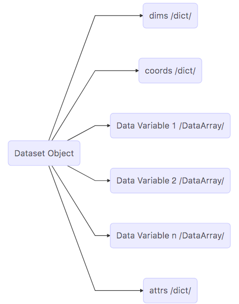
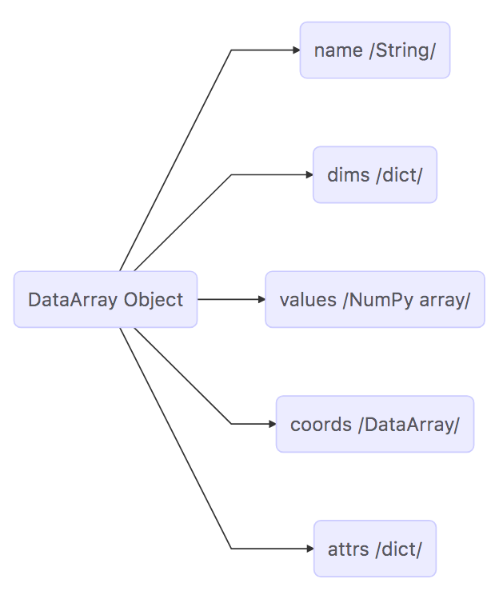

The Dataset and DataArray Objects Used in the ECCOv4 Python Package.
====================================================================

Objectives:
-----------

To introduce the two high-level data structures, ``Dataset`` and
``DataArray``, that are used in by the ECCOv4 Python package to load and
store the ECCO model grid parameters and state estimate variables

Because this is the first tutorial, we describe every step in detail.
Later tutorials will be less explicit about describing the basic
operations required to begin working with the state estimate.

Let's get started.

Import external packages and modules
------------------------------------

At the beginning of every Python program or interactive instance we need
to import helpful non-core modules or packages. Modules or packages that
are loaded into the environment can be thought of as external code
libraries and contain subroutines and/or data objects that provide
useful functionality.

.. code:: ipython2

    # Matplotlib is a Python 2D plotting library which produces publication quality
    # figures in a variety of hardcopy formats and interactive environments across 
    # platforms.
    # https://matplotlib.org/
    #
    # make all functions from the 'matplotlib.pylab' module available with the 
    # prefix 'plt'
    import matplotlib.pylab as plt
    
    # NumPy is the fundamental package for scientific computing with Python. 
    # It contains among other things:
    #    a powerful N-dimensional array object
    #    sophisticated (broadcasting) functions
    #    tools for integrating C/C++ and Fortran code
    #    useful linear algebra, Fourier transform, and random number capabilities
    # http://www.numpy.org/
    #
    # make all functions from the 'numpy' module available with the prefix 'np'
    import numpy as np
    
    # make all functions from the 'sys' module available with the prefix 'sys'
    import sys
    
    # xarray is an open source project and Python package that aims to bring the 
    # labeled data power of pandas to the physical sciences, by providing
    # N-dimensional variants of the core pandas data structures.
    # Our approach adopts the Common Data Model for self- describing scientific 
    # data in widespread use in the Earth sciences: xarray.Dataset is an in-memory
    # representation of a netCDF file.
    # http://xarray.pydata.org/en/stable/
    #
    # import all function from the 'xarray' module available with the prefix 'xr'
    import xarray as xr
    
    # The matplotlib basemap toolkit is a library for plotting 2D data on maps in
    # Python. ... Basemap is geared toward the needs of earth scientists, 
    # particularly oceanographers and meteorologists. 
    # https://matplotlib.org/basemap/index.html
    #
    # The 'copy' module provides generic ... copy operations."
    # "Assignment statements in Python do not copy objects, they create 
    # bindings [pointers] between a target and an object." "... a copy is 
    # sometimes needed so one can change one copy without changing the other."
    # https://docs.python.org/2/library/copy.html
    #
    # import the 'deepcopy' function from the 'copy' module
    from copy import deepcopy 
    
    # Modules to display images in Jupyter notebooks:
    from IPython.display import Image
    from IPython.core.display import HTML 

Load the ECCO Version 4 Python package
~~~~~~~~~~~~~~~~~~~~~~~~~~~~~~~~~~~~~~

The *ecco\_v4\_py* is a Python package written specifically for working
with the netcdf output provided in the
`nctiles\_monthly <ftp://ecco.jpl.nasa.gov/Version4/Release3/nctiles_monthly/>`__
directory of the `ECCO v4
release <ftp://ecco.jpl.nasa.gov/Version4/Release3/>`__

See the "Getting Started" page in the tutorial for instructions about
installing the *ecco\_v4\_py* module on your machine.

.. code:: ipython2

    sys.path.append('/Users/ifenty/git_repo/ECCOv4-py')
    import ecco_v4_py as ecco

The syntax *import X package as Y* allows you to access all of the
subroutines and other objects in X by typing *Y.some\_routine\_in\_X*.
Here, we import ``ecco_v4_py`` as ``ecco`` because it is less to type
than *ecco\_v4\_py* and by doing so we can access many subroutines
spread out over several modules within the *ecco\_v4\_py* package.

Load a single netCDF grid tile file
-----------------------------------

To load ECCO v4's netcdf files we will use the *open\_dataset* command
from the `xarray <http://xarray.pydata.org/en/stable/index.html>`__
Python package. *open\_dataset* creates a **Dataset** object and loads
the contents of the netcdf file, including its metadata, into a data
structure.

Let's open the grid file for *tile 3* (North East Atlantic Ocean), of
the 13 ECCO v4 llc90 grid files.

Change ``data_dir`` to match the location of your ``nctiles_grid``
directory.

.. code:: ipython2

    data_dir='/Volumes/ECCO_BASE/ECCO_v4r3/nctiles_grid/'    
    fname = 'GRID.0003.nc'
    ds = xr.open_dataset(data_dir + fname)

.. code:: ipython2

    type(ds)

.. parsed-literal::

    xarray.core.dataset.Dataset

The Dataset object
------------------

According to the xarray documentation, a
`Dataset <http://xarray.pydata.org/en/stable/generated/xarray.Dataset.html>`__
is a "Python object designed as an "in-memory representation of the data
model from the netCDF file format."

What does that mean? netCDF files are *self-describing* in the sense
that they `include information about the data they
contain <https://www.unidata.ucar.edu/software/netcdf/docs/faq.html>`__.
When Dataset objects are created by loading a netCDF file they contain
all of the same data and metadata provided by the netCDF file.

Just as a netCDF file can contain many variables, a ``Dataset`` object
can contain many variables. These variables are referred to as
``Data Variables`` in the ``xarray`` nomenclature.

Dataset objects contain three main classes of fields:

1. **Coordinates** : indices and labels for all of the coordinates used
   by all data variables
2. **Data Variables**: ``DataArray`` objects which contain numerical
   arrays, their coordinates, coordinate labels, and variable-specific
   metadata
3. **Attributes** : metadata

Now that we've loaded ``GRID.0003.nc`` into the ``ds`` ``Dataset``
object, let's examine its contents.

    **Note:** *You can get information about objects and their contents
    by typing the name of the variable and hitting **enter** in an
    interactive session of an IDE such as Spyder or a Jupyter notebook.*

.. code:: ipython2

    ds

.. parsed-literal::

    <xarray.Dataset>
    Dimensions:  (i1: 50, i2: 90, i3: 90)
    Coordinates:
      * i1       (i1) float64 1.0 2.0 3.0 4.0 5.0 6.0 7.0 8.0 9.0 10.0 11.0 12.0 ...
      * i2       (i2) float64 1.0 2.0 3.0 4.0 5.0 6.0 7.0 8.0 9.0 10.0 11.0 12.0 ...
      * i3       (i3) float64 1.0 2.0 3.0 4.0 5.0 6.0 7.0 8.0 9.0 10.0 11.0 12.0 ...
    Data variables:
        hFacC    (i1, i2, i3) float64 ...
        hFacW    (i1, i2, i3) float64 ...
        hFacS    (i1, i2, i3) float64 ...
        XC       (i2, i3) float64 ...
        YC       (i2, i3) float64 ...
        XG       (i2, i3) float64 ...
        YG       (i2, i3) float64 ...
        RAC      (i2, i3) float64 ...
        RAZ      (i2, i3) float64 ...
        DXC      (i2, i3) float64 ...
        DYC      (i2, i3) float64 ...
        DXG      (i2, i3) float64 ...
        DYG      (i2, i3) float64 ...
        Depth    (i2, i3) float64 ...
        AngleCS  (i2, i3) float64 ...
        AngleSN  (i2, i3) float64 ...
        RC       (i1) float64 ...
        RF       (i1) float64 ...
        DRC      (i1) float64 ...
        DRF      (i1) float64 ...
    Attributes:
        description:    C-grid parameters (see MITgcm documentation for details)....
        A:              :Format      = native grid (nctiles w. 13 tiles)
        B:              :source      = ECCO consortium (http://ecco-group.org/)
        C:              :institution = JPL/UT/MIT/AER
        D:              :history     = files revision history :
        E:                                 04/20/2017: fill in geometry info for ...
        F:                                 11/06/2016: third release of ECCO v4 (...
        G:                             estimates revision history (from second re...
        H:                                 employs bi-harmonic viscosity (enhance...
        I:                                 sea-ice parameters, updated or novel o...
        J:                                 GRACE OBP, Aquarius SSS, global mean s...
        K:                                 time-series, extended and/or expanded ...
        L:                                 revised weights including data and con...
        M:                                 to account for grid-size variation and...
        N:                                 separate time-mean and time-variable d...
        O:                                 and controls, sea-ice costs, and initi...
        P:                                 additional controls.\n 
        Q:              :references  = Forget, G., J.-M. Campin, P. Heimbach, C. ...
        R:                              and C. Wunsch, 2015: ECCO version 4: an i...
        S:                              non-linear inverse modeling and global oc...
        T:                              Geoscientific Model Development, 8, 3071-...
        U:                             Forget, G., J.-M. Campin, P. Heimbach, C. ...
        V:                              ECCO version 4: Second Release, 2016, htt...
        W:              file created using gcmfaces_IO/write2nctiles.m
        date:           21-Apr-2017
        Conventions:    CF-1.6
        _FillValue:     nan
        missing_value:  nan

Examining the Dataset object contents
~~~~~~~~~~~~~~~~~~~~~~~~~~~~~~~~~~~~~

Let's go through ``ds`` piece by piece, starting from the top.

1. Object type
^^^^^^^^^^^^^^

``<xarray.Dataset>``

The top line tells us what type of object the variable is. In this case
``ds`` is an instance of the ``Dataset`` object from the ``xarray``
package.

2. Dimensions
^^^^^^^^^^^^^

``Dimensions:  (i1: 50, i2: 90, i3: 90)``

The *Dimensions* list shows all of the different dimensions used by all
of the different arrays stored in the netCDF file (and now loaded in the
``Dataset`` object.)

Arrays may use any combination of these dimensions. In the case of the
netcdf ECCO grid file that we've loaded, there are 1D, 2D, and 3D
arrays.

The names and lengths of the three dimensions is given by:
``(i1: 50, i2: 90, i3: 90)``. There are 50 vertical levels in the ECCO
v4 model grid so the ``i1`` obviously corresponds to the vertical
dimension while ``i2``\ \| and ``i3`` correspond to the horizontal
dimensions.

    **Note:** Each tile in the llc90 grid used by ECCO v4 has 90x90
    horizontal grid points. That's where the "90: in llc\ **90** comes
    from!

3. Coordinates
^^^^^^^^^^^^^^

::

    Coordinates:
        i1       (i1) float64 1.0 2.0 3.0 4.0 5.0 6.0 7.0 8.0 9.0 10.0 11.0 12.0 ...
        i2       (i2) float64 1.0 2.0 3.0 4.0 5.0 6.0 7.0 8.0 9.0 10.0 11.0 12.0 ...
        i3       (i3) float64 1.0 2.0 3.0 4.0 5.0 6.0 7.0 8.0 9.0 10.0 11.0 12.0 ... 

**i1**, **i2**, and **i3** are the
`coordinates <http://xarray.pydata.org/en/stable/data-structures.html#coordinates>`__,
which are Python dictionaries of arrays whose values *label* each point.
They are used for label-based indexing and alignment.

In this case, the *coordinates* of each dimension consist of *labels*
:math:`[1, 2, ... n]`, where :math:`n` is the length of the dimension:

-  Dim **i1**: ``array([  1.,   2., ..., 50.])``
-  Dim **i2** and **i3**: ``array([  1.,   2., ..., 90.])``

    **Note:** Actually these coordinates are **Dimension coordinates**
    which are one dimensional coordinates (marked by an asterix **"\*"**
    when printing a dataset or data array). Don't worry what that means
    for now, we'll return to the topic in a later tutorial.

4. Data Variables
^^^^^^^^^^^^^^^^^

::

    Data variables:
        hFacC    (i1, i2, i3) float64 ...
        hFacW    (i1, i2, i3) float64 ...
        hFacS    (i1, i2, i3) float64 ...
        ...
        XC       (i2, i3) float64 ...
        YC       (i2, i3) float64 ...
        ...
        RC       (i1) float64 ...
        RF       (i1) float64 ...

The ``Data Variables`` are one or more ``xarray.DataArray`` objects.
``DataArray`` objects are labeled, multi-dimensional arrays that may
also contain metadata (attributes). ``DataArray`` objects are very
important to understand because they are container objects that
containing the actual numerical arrays for the different ECCO variables.
We'll investigate these objects in more detail after finishing with the
``Dataset`` object.

A subset of all ``Data variables`` in ``ds`` are shown above to
demonstrate that in this netcdf grid file there are variables with three
different dimension combinations: 3D with dimensions (**i1**, **i2**,
**i3**), 2D with dimensions (**i2**, **i3**), and 1D with dimensions
(**i1**)

Here, the 1D variables only have values in the **i1** (vertical)
dimension, the 2D variables only have values in the **i2** and **i3**
(horizontal) dimensions, and the 3D variables have values in all three
dimensions. All of these variables are of type 64 bit float.

    **Note:** All ECCO v4 netcdf grid files include a number of grid
    parameters. Of these, 3 are 3D, 13 are 2D, and 4 are 1D. The 3D grid
    parameters vary with horizontal location and depth (e.g., **hFacC**,
    the vertical fraction of a grid cell of the Arakawa-C grid tracer
    'c' point). The 2D grid parameters only vary with horizontal
    location and are therefore independent of depth (e.g., **XC** the
    longitude of the tracer 'c' point). The 1D grid parameters only vary
    with depth and are therefore independent of horizontal location
    (e.g., **RF** the height of a tracer 'c' grid cell). The meaning of
    all MITgcm grid parameters is described in section `2.10.5 of the
    MITgcm
    documentation <http://mitgcm.org/sealion/online_documents/node47.html>`__.

5. Attributes
^^^^^^^^^^^^^

::

    Attributes:
        description:    C-grid parameters (see MITgcm documentation for details)....
        A:              :Format      = native grid (nctiles w. 13 tiles)
        B:              :source      = ECCO consortium (http://ecco-group.org/)
        C:              :institution = JPL/UT/MIT/AER
        D:              :history     = files revision history :
        E:                                 04/20/2017: fill in geometry info for ...
        F:                                 11/06/2016: third release of ECCO v4 (...
        ...
        W:              file created using gcmfaces_IO/write2nctiles.m
        date:           21-Apr-2017
        Conventions:    CF-1.6
        _FillValue:     nan
        missing_value:  nan

The ``attrs`` variable is a Python `dictionary
object <https://www.python-course.eu/dictionaries.php>`__ containing
metadata or any auxilliary information.

Metadata is presented as a set of dictionary ``key-value`` pairs. Here
the ``keys`` are *description, A, B, ... missing\_value.* while the
``values`` are the corresponding text and non-text values.

To see the metadata ``value`` associated with the metadata "Conventions"
``key`` we type:

.. code:: ipython2

    print ds.attrs['Conventions']

.. parsed-literal::

    CF-1.6

The resulting "CF-1.6" tells us that ECCO netcdf output conforms to the
`**Climate and Forecast Conventions version
1.6** <http://cfconventions.org/>`__.

Map of the ``Dataset`` Object
~~~~~~~~~~~~~~~~~~~~~~~~~~~~~

Taking a big step back we can now imagine the ``Dataset`` object using
the following diagram:

We see that a ``Dataset`` object is a really *container* comprised of
(actually pointing to) a set of other objects.

-  dims: A ``dict`` that maps dimension names with dimension lengths
-  coords: A ``dict`` that maps dimension names (e.g,. **i1**, **i2**,
   **i3**) with arrays that label each point in the dimension
-  One or more ``Data Variables`` that are pointers to ``DataArray``
   Objects
-  attrs A ``dict`` that maps different attribute names with the
   attributes themselves.

   DataArray-diagram

The DataArray Object
--------------------

It is worth looking at the ``DataArray`` object in more detail because
these containers actually store the arrays that we will be using when
analyzing ECCO output. Please see the `xarray documentation on the
DataArray
object <http://xarray.pydata.org/en/stable/data-structures.html#dataarray>`__
for more information.

``DataArray`` objects are actually very similar to ``Dataset`` objects.
Like ``Dataset`` objects they also contain dimensions, coordinates, and
attributes. The biggest difference is that they have a **name**, a
string that identifies the name of the variable, and an array of
**values**. The **values** array is a `numpy
array <https://docs.scipy.org/doc/numpy-1.13.0/reference/generated/numpy.array.html>`__.

Examining the ``DataArray Object`` contents
~~~~~~~~~~~~~~~~~~~~~~~~~~~~~~~~~~~~~~~~~~~

Let's examine the contents of one ``DataArray`` found in ``ds``, ``XC``:

.. code:: ipython2

    ds.XC

.. parsed-literal::

    <xarray.DataArray 'XC' (i2: 90, i3: 90)>
    array([[-37.5     , -36.5     , -35.5     , ...,  49.5     ,  50.5     ,  51.5     ],
           [-37.5     , -36.5     , -35.5     , ...,  49.5     ,  50.5     ,  51.5     ],
           [-37.5     , -36.5     , -35.5     , ...,  49.5     ,  50.5     ,  51.5     ],
           ..., 
           [-37.730072, -37.178291, -36.597565, ...,  50.597565,  51.178291,
             51.730072],
           [-37.771988, -37.291943, -36.764027, ...,  50.764027,  51.291943,
             51.771988],
           [-37.837925, -37.44421 , -36.968143, ...,  50.968143,  51.44421 ,
             51.837925]])
    Coordinates:
      * i2       (i2) float64 1.0 2.0 3.0 4.0 5.0 6.0 7.0 8.0 9.0 10.0 11.0 12.0 ...
      * i3       (i3) float64 1.0 2.0 3.0 4.0 5.0 6.0 7.0 8.0 9.0 10.0 11.0 12.0 ...
    Attributes:
        long_name:  longitude
        units:      degrees_east

Examining the ``DataArray Object`` contents
~~~~~~~~~~~~~~~~~~~~~~~~~~~~~~~~~~~~~~~~~~~

The layout of the contents of ``DataArray`` objects is similar to those
of ``Dataset`` objects which makes it easier to understand the meaning
of some of its fields. Let's go through ``ds.XC`` piece by piece,
starting from the top.

1. Object type
^^^^^^^^^^^^^^

``<xarray.DataArray>``

This is indeed a ``DataArray`` object from the ``xarray`` package.

    Note: You can also find the type of an object with the ``type``
    command: ``print type(ds.XC)``

2. Object Name
^^^^^^^^^^^^^^

``XC``

The top line tells us what type of object the variable is. In this case
``ds`` is an instance of the ``Dataset``

3. Dimensions
^^^^^^^^^^^^^

``Dimensions:  (i2: 90, i3: 90)``

Unlike the ``ds`` object, the XC ``DataArray`` only has two dimensions,
**i2** and **i3**. This makes sense since the longitude of the grid cell
centers only vary with horizontal location.

4. Array
^^^^^^^^

::

    array([[-37.5     , -36.5     , -35.5     , ...,  49.5     ,  50.5     ,  51.5     ],
           [-37.5     , -36.5     , -35.5     , ...,  49.5     ,  50.5     ,  51.5     ],
           [-37.5     , -36.5     , -35.5     , ...,  49.5     ,  50.5     ,  51.5     ],
           ..., 
           [-37.730072, -37.178291, -36.597565, ...,  50.597565,  51.178291,
             51.730072],
           [-37.771988, -37.291943, -36.764027, ...,  50.764027,  51.291943,
             51.771988],
           [-37.837925, -37.44421 , -36.968143, ...,  50.968143,  51.44421 ,
             51.837925]])

Unlike the ``Dataset`` object there are no ``Data Variables``. Instead,
we find an **array** of values. Python prints out a subset of the array.

``DataArray`` objects store *only one* array while ``DataSet`` objects
store one or more ``DataArrays``.

4. Coordinates
^^^^^^^^^^^^^^

::

    Coordinates:
      i2       (i2) float64 1.0 2.0 3.0 4.0 5.0 6.0 7.0 8.0 9.0 10.0 11.0 12.0 ...
      i3       (i3) float64 1.0 2.0 3.0 4.0 5.0 6.0 7.0 8.0 9.0 10.0 11.0 12.0 ...

We find two 1D arrays with coordinate labels for **i2** and **i3**.

5. Attributes
^^^^^^^^^^^^^

::

    Attributes:
        long_name:  longitude
        units:      degrees_east

The ``XC`` variable has a ``long_name`` (longitude) and units
(degrees\_east). Of course, this metadata comes from the netCDF file.

Accessing the numpy array stored in a ``DataArray`` object
~~~~~~~~~~~~~~~~~~~~~~~~~~~~~~~~~~~~~~~~~~~~~~~~~~~~~~~~~~

To access the numpy array storing the values of the variable in the
``DataArray`` object we access its ``values`` field as follows,

.. code:: ipython2

    ds.XC.values

.. parsed-literal::

    array([[-37.5       , -36.5       , -35.5       , ...,  49.5       ,
             50.5       ,  51.5       ],
           [-37.5       , -36.5       , -35.5       , ...,  49.5       ,
             50.5       ,  51.5       ],
           [-37.5       , -36.5       , -35.5       , ...,  49.5       ,
             50.5       ,  51.5       ],
           ..., 
           [-37.73007202, -37.17829132, -36.5975647 , ...,  50.5975647 ,
             51.17829132,  51.73007202],
           [-37.77198792, -37.2919426 , -36.76402664, ...,  50.76402664,
             51.2919426 ,  51.77198792],
           [-37.83792496, -37.44421005, -36.96814346, ...,  50.96814346,
             51.44421005,  51.83792496]])

The array that is returned is a numpy n-dimensional array:

.. code:: ipython2

    type(ds.XC.values)

.. parsed-literal::

    numpy.ndarray

Being a numpy array, one can use all of the numerical operations
provided by the numpy module on it. > \*\* Note: \*\* You may find it
useful to learn about the operations that can be made on numpy arrays.
Here is a quickstart guide:
https://docs.scipy.org/doc/numpy-dev/user/quickstart.html

We'll learn more about how to access the values of this array in a later
tutorial. For now it is sufficient to know where to find the arrays!

Map of the ``DataArray`` Object
~~~~~~~~~~~~~~~~~~~~~~~~~~~~~~~

Taking another big step back we can now understand the layout of the
``DataArray`` object:

   DataArray-diagram

Conclusion
----------

Now you know the basics of the ``Dataset`` and ``DataArray`` objects
that will store the ECCO v4 grid and variables. Now that you're
oriented, go back and take another look at the contents of the grid
``ds`` object that we originally loaded!
